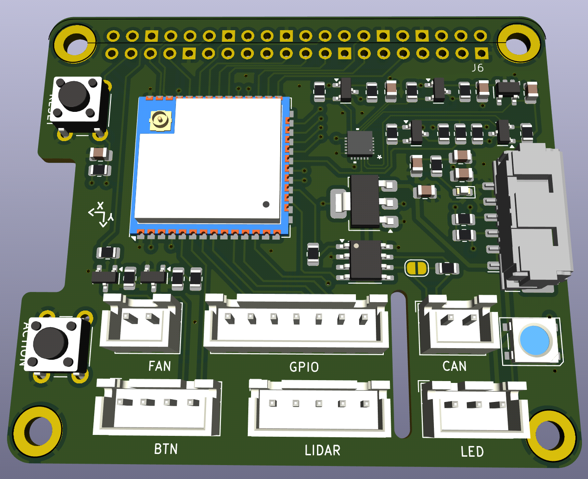
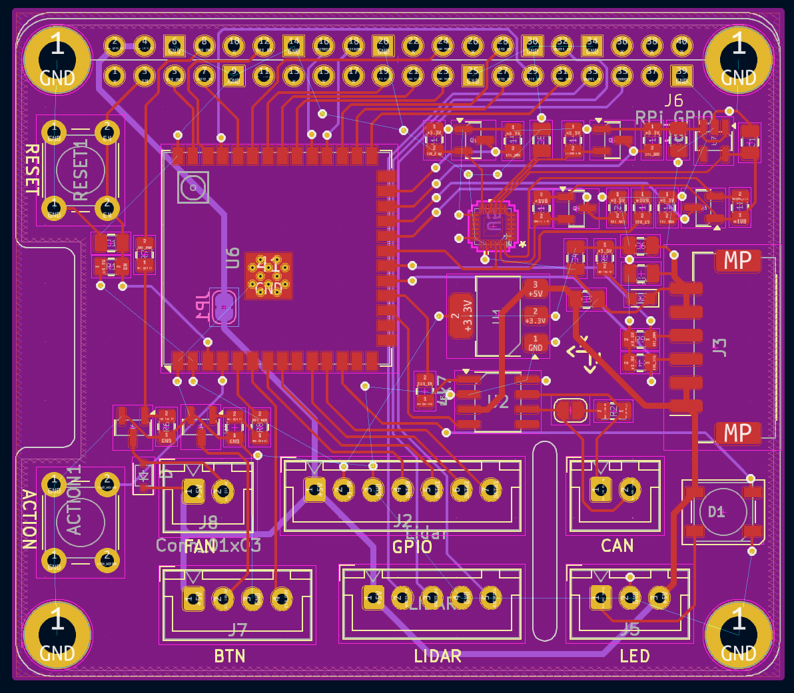

# CyberBoard - Raspberry PI 4

This is the Kicad project for the CyberBoard Raspberry PI HAT. It has an ESP32S3 which is
connected via UART to the Raspberry PI. The microcontroller drives the cybergear 
motors via CAN. Furthermore a MOLEX CLIK connector is integrated in order
to communicate with the power distribution board [Holybro PM03D Pixhawk 5X Power
Module](https://docs.holybro.com/power-module-and-pdb/power-module/digital-power-module-pm-setup).

## Features

* 5V power supply connectior compatible with **Holybro PM03D Pixhawk** with
  support for the INA226 power monitor unit.
* ESP32S3 with dual-core CPU.
* CAN transceiver TJA1051T for communication with **Xiaomi CyberGears**.
* 5V fan connector for Raspberry PI with support for `gpio-fan` (PWM).
* Connector for external WS2812B LEDs.
* Connector 4x GPIO including 3.3V and 5V supply.
* Conenctor for lidar sensors from Slamtec (tested with RPLIDAR A3).
* 2x UART communication lines between ESP32S3 and Raspberry PI.
  * Serial log for debugging purposes, flashing and burning fuse-bits.
  * **ROS2 Serial Agent** communication
* **JTAG** connection between ESP32S3 and Raspberry PI
* Connector for external switch/button with LED support.

